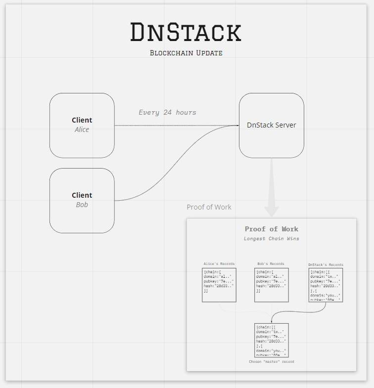
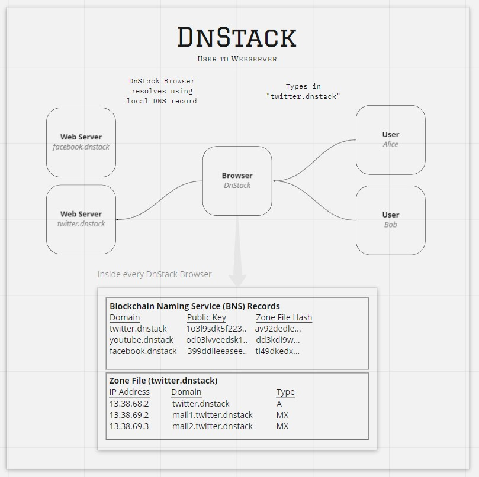

# DnStack
Implementing DNS with Blockchain Technology

## Flow Diagram




---
## Installation

### Version
- Make sure your computer comes with Python 3
- If not, go to `https://www.python.org/downloads/` to download your Python now !

### Clone
- Clone this repo to your local machine
> Using git command line
```code
git clone https://github.com/southzyzy/DnStack
```

### Setup
- Install the required dependencies
> Using python3-pip
```shell
pip3 install pandas gevent flask flask-wtf pycryptodome
```

---

## Documentation


---

## Contributors
- **Tan Zhao Yea**
- **Gerald Peh Wei Xiang**
