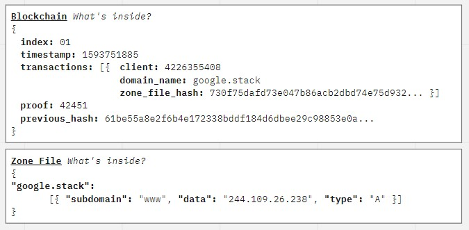

# DnStack
Implementing DNS with Blockchain Technology

## Installation

### Version
- Make sure your computer comes with Python 3
- If not, go to `https://www.python.org/downloads/` to download your Python now !

### Clone
- Clone this repo to your local machine
> Using git command line
```code
git clone https://github.com/southzyzy/DnStack
```

### Setup
- Install the required dependencies
> Using python3-pip
```shell
pip3 install pandas gevent flask flask-wtf pycryptodome
```

---

## Documentation

### Flow Diagram


### Concept
#### DnStack vs DNS
DnStack is following the concept of Blockstack DNS (BNS). The idea is listed in their documentation and DnStack is a Proof-of-Concept (POC) on how BNS works.
> Read More

<a href="https://docs.blockstack.org/core/naming/comparison.html#blockstack-vs-dns">Blockstack vs DNS</a>


### Consensus
The whole point of Blockchains is that they should be decentralized. And if they’re decentralized, how on earth do we ensure that they all reflect the same chain? This is called the problem of Consensus, and we’ll have to implement a Consensus Algorithm if we want more than one node in our network.

We then implement this Consensus Algorithm call <a href="https://www.ledger.com/academy/blockchain/what-is-proof-of-work">Proof-of-Work (POW)</a>. 
> "Proof-of-work is essentially one-CPU-one-vote. The majority decision is represented by the longest chain, which has the greatest proof-of-work effort invested in it. If a majority of CPU power is controlled by honest nodes, the honest chain will grow the fastest and outpace any competing chains."

In other words, the longest chain on the network is the de-facto one. Using this algorithm, we reach Consensus amongst the nodes in our network.

### Inside DnStack


---

## Running the Program
This project requires the following script to operate:
1. Broker.py
2. run.py (Web UI of Broker) (Optional to run)
3. miner.py
4. alice.py
5. bob.py

### Broker.py
> This is the Broker script that handles the traffic flow, and the main leader for our Blockchain.
```commandline
python3 broker.py
```

### Web UI for Broker.py
> Web UI for the Broker program, to access go to <a href="http://localhost:1337">`http://localhost:1337`</a>

### Miner.py
> Mining program to calculate Proofs for nodes and communicates with the Broker.
```commandline
python3 miner.py
```

### Alice.py & Bob.py
> Nodes in our DnStack network.
```commandline
python3 alice.py
python3 bob.py
```

---

## Contributors
| **Gerald Peh** | **Tan Zhao Yea**
| :---: |:---:|
| [](https://www.linkedin.com/in/gxraldpeh/)    | [](https://sg.linkedin.com/in/tan-zhao-yea-114278131)
| <a href="https://github.com/hellogeraldblah" target="_blank">`github.com/hellogeraldpeh`</a> | <a href="http://github.com/southzyzy" target="_blank">`github.com/southzyzy`</a>

